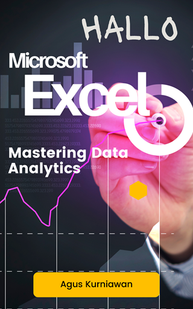

# Hallo Microsoft Excel: Mastering Data Analytics

Dive into the world of data analytics with **Hallo Microsoft Excel: Mastering Data Analytics**, a comprehensive guide designed to unlock the full potential of Microsoft Excel as a powerful tool for data analysis. From the basics of data entry and formatting to the complexities of dynamic reports and dashboards, this book demystifies Excel's most advanced features, making them accessible to analysts, data enthusiasts, and professionals seeking to enhance their analytical skills. Through a series of hands-on labs and real-world scenarios inspired by discussions from a vibrant online community, readers will learn to navigate Excel's intricate functionalities with ease and confidence.

**Hallo Microsoft Excel: Mastering Data Analytics** takes you on a journey through the art of data visualization, conditional formatting, growth analysis, and beyond, offering practical instructions and expert tips every step of the way. Whether you're analyzing sales data, exploring market trends, or creating compelling visual reports, this book provides the insights and step-by-step guidance needed to transform raw data into actionable insights. By leveraging Excel's capabilities for interactive reporting, you'll discover how to present data that speaks volumes, making complex analyses understandable and engaging for any audience.

Designed with the reader in mind, this book bridges the gap between theoretical knowledge and practical application, ensuring you can apply Excel's data analytics capabilities to your real-world challenges immediately. **Hallo Microsoft Excel: Mastering Data Analytics** is not just a manual; it's a transformational tool that empowers you to make informed decisions based on robust data analysis. Whether you're a novice eager to learn or a seasoned professional looking to refine your skills, this book is an essential resource for anyone ready to harness the power of Excel for data analytics.

## Hands-on Lab Exercises
This is a list of the exercises in the book. Each exercise is designed to help you learn the concepts and techniques discussed in the book.

- Exercise 1: Setting up SQL Server Data Source
- Exercise 2: Loading Data from SQL Server into Excel
- Exercise 3: Get Data from SQL Server
- Exercise 4: Preview Data in Power Query Editor
- Exercise 5: Get Data from a CSV file
- Exercise 6: Configure the Salesperson Query
- Exercise 7: Configure the SalespersonRegion Query
- Exercise 8: Configure the Product Query
- Exercise 9: Configure the Reseller Query
- Exercise 10: Configure the Sales Query
- Exercise 11: Configure the Targets Query
- Exercise 12: Configure the ColorFormats Query
- Exercise 13: Update the Product Query
- Exercise 14: Edit the Queries and Connections
- Exercise 15: Basic Data Visualization in Excel
- Exercise 16: Create Table from Worksheet
- Exercise 17: Excel Sparklines
- Exercise 18: Building Maps in Excel
- Exercise 19: Recommended Charts in Excel
- Exercise 20: Working with PivotTables and PivotCharts
- Exercise 21: Working with Slicer
- Exercise 22: What-If Analysis in Excel
- Exercise 23: Creating a Forecast Sheet
- Exercise 24: Building Dynamic Reports in Excel
- Exercise 25: Building Dashboards in Excel
- Exercise 26: Sharing and Publishing Interactive Reports
- Exercise 27: Conditional Formatting in Excel Reports
- Exercise 28: Growth Analysis in Excel Reports

## How to Buy

You can buy this book the following online stores:

* Google Play Books: https://play.google.com/store/books/details?id=t831EAAAQBAJ
* Lulu: https://www.lulu.com/shop/agus-kurniawan/hallo-microsoft-excel-mastering-data-analytics/ebook/product-5799z22.html 
* Apple iBookstore: 